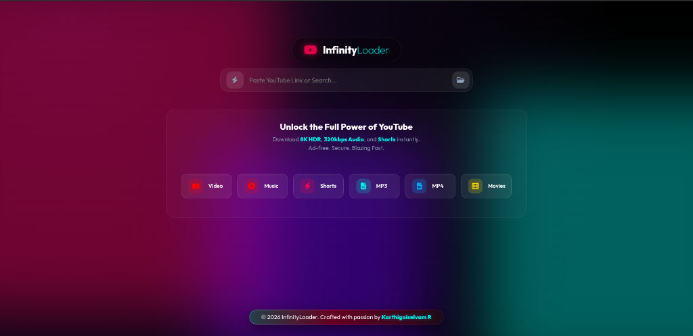

# 🌌 InfinityLoader v2

[](https://www.gnu.org/licenses/gpl-3.0)

> **The Ultimate YouTube Experience. Reimagined.**



InfinityLoader v2 is not just a downloader; it is an **Artistic Statement**. Built with a focus on "Expert Level" UI/UX, it combines raw power with a breathtaking **Aurora Glass Interface**.

## ✨ Design Philosophy: The Aurora Engine
We abandoned flat design for a living, breathing interface.
-   **Dynamic Aurora Background**: A perpetually drifting, multi-layer nebulous backdrop that feels alive.
-   **Glassmorphism**: Every element is crafted with real-time backdrop fuzzing, simulating frosted glass floating in 3D space.
-   **Neon Accents**: Cyberpunk-inspired `Cyan` and `Hot Pink` gradients that pulse and react to your touch.

## 🚀 Key Features
-   **8K HDR Support**: Download videos in their full, uncompressed glory.
-   **320kbps High-Fidelity Audio**: Extract crystal clear soundscapes.
-   **Shorts & Movies**: Dedicated modes for every content type.
-   **Blazing Fast**: Powered by an optimized Python backend (yt-dlp).

## 🎨 UI Masterpieces

### 1. The Living Footer
The footer isn't just a static bar. It is a **Smart Component**:
-   **True Sticky Positioning**: Sticks to the bottom when empty, pushes down gracefully when content overflows.
-   **Perpetual Levitation**: It gently "floats" (bobs) up and down, defying gravity.
-   **Interactive Focus**: Hovering **pauses time** (stops the float), snaps the element to attention, and ignites a **Neon Cyan Plasma Border**.

### 2. The Hero Dashboard
-   **Cinematic Previews**: Video thumbnails are presented in a glowing glass frame.
-   **Format Pills**: Floating glass chips for selecting Video, Audio, or Movies.

## 🛠️ Installation

```bash
# Clone the repository
git clone https://github.com/Karthigaiselvam-R-official/InfinityLoader.git

# Enter the dimension
cd InfinityLoader

# Install dependencies
pip install -r requirements.txt

# Ignite the engine
python app/main.py
```

## 👨‍💻 Credits
Crafted with passion by **Karthigaiselvam R**.
*© 2026 InfinityLoader. All rights reserved.*

## 📜 License
This project is licensed under the **GNU General Public License v3.0**.
See the [LICENSE](LICENSE) file for details.
