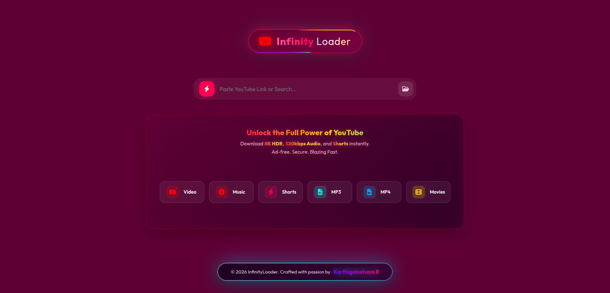

<div align="center">

# 🌌 InfinityLoader v2

### *The Ultimate YouTube Experience. Reimagined.*

<br/>

[](https://www.gnu.org/licenses/gpl-3.0)
[](https://python.org)
[](https://fastapi.tiangolo.com/)
[](https://github.com/yt-dlp/yt-dlp)

<br/>



<br/>

**⚡ Download 8K HDR Videos • 🎵 320kbps High-Fidelity Audio • 🎬 Shorts & Movies**

<br/>

[✨ Features](#-features) •
[🎨 UI Design](#-ui-design-philosophy) •
[🚀 Installation](#-quick-start) •
[📖 Usage](#-usage) •
[🛠️ Tech Stack](#️-tech-stack) •
[📜 License](#-license)

---

</div>

<br/>

## 🌟 What is InfinityLoader?

InfinityLoader v2 is not just a YouTube downloader — it's an **Artistic Statement**. We've crafted a tool that combines raw downloading power with a breathtaking **Aurora Glass Interface** that feels like it's from the future.

> *"We didn't just build a downloader. We built an experience."*

<br/>

## ✨ Features

<table>
<tr>
<td width="50%">

### 📹 Video Downloads
- **8K HDR Support** — Full resolution glory
- **4K, 1080p, 720p** — All qualities available
- **MP4 Format** — Universal compatibility
- **Thumbnail Embedding** — Beautiful file icons

</td>
<td width="50%">

### 🎵 Audio Extraction
- **320kbps MP3** — Crystal clear audio
- **High-Fidelity Quality** — Studio-grade sound
- **Metadata Tagging** — Auto artist/title info
- **Album Art** — Embedded cover images

</td>
</tr>
<tr>
<td width="50%">

### ⚡ Performance
- **Blazing Fast** — Optimized yt-dlp engine
- **Multi-threaded** — Parallel processing
- **Resume Support** — Continue interrupted downloads
- **Smart Caching** — Faster repeated requests

</td>
<td width="50%">

### 🎬 Content Types
- **Regular Videos** — Standard YouTube content
- **YouTube Shorts** — Short-form vertical videos
- **Movies** — Full-length films (where available)
- **Playlists** — Batch download support

</td>
</tr>
</table>

<br/>

## 🎨 UI Design Philosophy

We abandoned flat, boring designs for a **living, breathing interface**.

<div align="center">

### 🌌 The Aurora Engine

</div>

<table>
<tr>
<td align="center" width="33%">

### 🔮 Glassmorphism

Every element features real-time **backdrop blur**, simulating frosted glass floating in 3D space. Elements have depth, transparency, and subtle reflections.

</td>
<td align="center" width="33%">

### 💫 Neon Accents

Cyberpunk-inspired **Cyan** and **Hot Pink** gradients that pulse, glow, and react to your interactions. Every hover ignites a plasma border.

</td>
<td align="center" width="33%">

### 🌊 Aurora Background

A perpetually drifting, multi-layer **nebulous backdrop** using CSS animations. It breathes, it flows, it's alive.

</td>
</tr>
</table>

<br/>

### � UI Components

<details>
<summary><b>🦶 The Living Footer</b></summary>
<br/>

The footer isn't just static text — it's a **Smart Component**:

- 🎈 **Perpetual Levitation** — Gently floats up and down, defying gravity
- 🌈 **Animated Gradient Border** — Flowing colors around the pill
- ⏸️ **Interactive Focus** — Hovering pauses animation and ignites glow
- 🎯 **Always Centered** — Fixed at bottom, perfectly aligned

</details>

<details>
<summary><b>🎯 The Search Bar</b></summary>
<br/>

A glass pill that glows with anticipation:

- 🔴 **Red Paste Button** — Always visible, one-click paste
- 📁 **Cyan Folder Button** — Choose your download location
- ✨ **Focus Glow** — Input field illuminates when active
- 🔍 **Smart Detection** — Auto-detects YouTube URLs

</details>

<details>
<summary><b>🎪 Feature Pills</b></summary>
<br/>

Six floating glass cards showcasing capabilities:

- 📹 **Video** | 🎵 **Music** | ⚡ **Shorts**
- 🎧 **MP3** | 🎬 **MP4** | 🎥 **Movies**

Each pill has:
- Hover lift animation
- Cyan glow effect
- Icon with subtle shadow

</details>

<details>
<summary><b>📺 Video Preview Card</b></summary>
<br/>

When a YouTube URL is detected:

- 🖼️ **Cinematic Thumbnail** — High-res preview in glass frame
- 📝 **Title Display** — Video title with gradient text
- ⏱️ **Duration Badge** — Floating time indicator
- 📊 **Format Grid** — Available qualities displayed as cards

</details>

<br/>

## 🚀 Quick Start

### Prerequisites

- Python 3.8 or higher
- pip (Python package manager)
- FFmpeg (for audio/video processing)

### Installation

```bash
# 📥 Clone the repository
git clone https://github.com/Karthigaiselvam-R-official/InfinityLoader.git

# 📂 Enter the dimension
cd InfinityLoader

# 📦 Install dependencies
pip install -r requirements.txt

# 🚀 Ignite the engine
python app/main.py
```

### 🌐 Access the App

Open your browser and navigate to:
```
http://localhost:8000
```

<br/>

## � Usage

<table>
<tr>
<td>

### 1️⃣ Paste URL
Copy any YouTube video URL and click the **red paste button** or paste directly into the search bar.

</td>
</tr>
<tr>
<td>

### 2️⃣ Choose Format
Select your desired quality from the available formats:
- **Video**: 8K, 4K, 1080p, 720p, 480p
- **Audio**: 320kbps, 256kbps, 128kbps

</td>
</tr>
<tr>
<td>

### 3️⃣ Download
Click the download button and watch the magic happen! Files are saved to your chosen folder.

</td>
</tr>
</table>

<br/>

## 🛠️ Tech Stack

<div align="center">

| Layer | Technology |
|-------|------------|
| 🎨 **Frontend** | HTML5, CSS3, Vanilla JavaScript |
| ⚡ **Backend** | Python, FastAPI, Uvicorn |
| 📥 **Engine** | yt-dlp (YouTube extraction) |
| 🎵 **Processing** | FFmpeg (audio/video encoding) |
| 🎭 **Styling** | Custom CSS with CSS Variables |
| ✨ **Animations** | Pure CSS Keyframe Animations |

</div>

<br/>

## 📁 Project Structure

```
InfinityLoader/
├── 📂 app/
│   ├── 🐍 main.py          # FastAPI server
│   └── 🐍 downloader.py    # yt-dlp integration
├── 📂 static/
│   ├── 📄 index.html       # Main UI
│   ├── 🎨 style.css        # Aurora Glass styles
│   └── ⚡ script.js        # Frontend logic
├── 📂 public/
│   └── 🖼️ image.png        # Showcase image
├── 📋 requirements.txt     # Python dependencies
├── 📜 LICENSE              # GPL v3 License
└── 📖 README.md            # You are here!
```

<br/>

## 🎯 Roadmap

- [x] 8K HDR Video Support
- [x] 320kbps Audio Extraction
- [x] Aurora Glass UI
- [x] Animated Footer
- [x] Format Selection Grid
- [ ] Playlist Download Support
- [ ] Download Queue Manager
- [ ] Dark/Light Theme Toggle
- [ ] Browser Extension
- [ ] Mobile Responsive Design

<br/>

## 🤝 Contributing

Contributions are what make the open-source community amazing! Any contributions you make are **greatly appreciated**.

1. Fork the Project
2. Create your Feature Branch (`git checkout -b feature/AmazingFeature`)
3. Commit your Changes (`git commit -m 'Add some AmazingFeature'`)
4. Push to the Branch (`git push origin feature/AmazingFeature`)
5. Open a Pull Request

<br/>

## 👨‍💻 Author

<div align="center">

**Karthigaiselvam R**

*Crafted with ❤️ and countless cups of coffee*

[](https://github.com/Karthigaiselvam-R-official)

</div>

<br/>

## 📜 License

This project is licensed under the **GNU General Public License v3.0**.

See the [LICENSE](LICENSE) file for details.

```
This program is free software: you can redistribute it and/or modify
it under the terms of the GNU General Public License as published by
the Free Software Foundation, either version 3 of the License, or
(at your option) any later version.
```

<br/>

---

<div align="center">

### 🌟 If you found this useful, please consider giving it a ⭐

<br/>

**© 2026 InfinityLoader. All rights reserved.**

*Built with passion. Designed with love. Powered by creativity.*

<br/>


</div>
